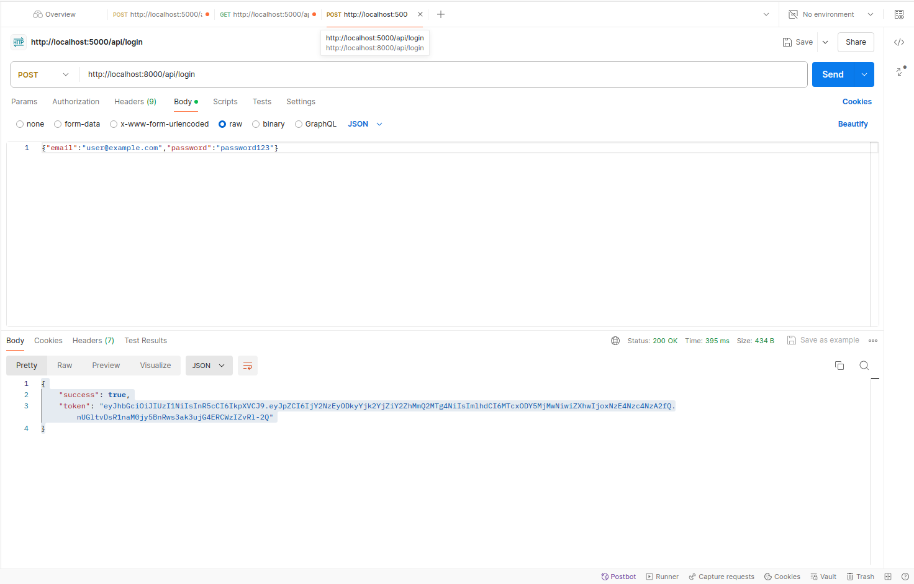
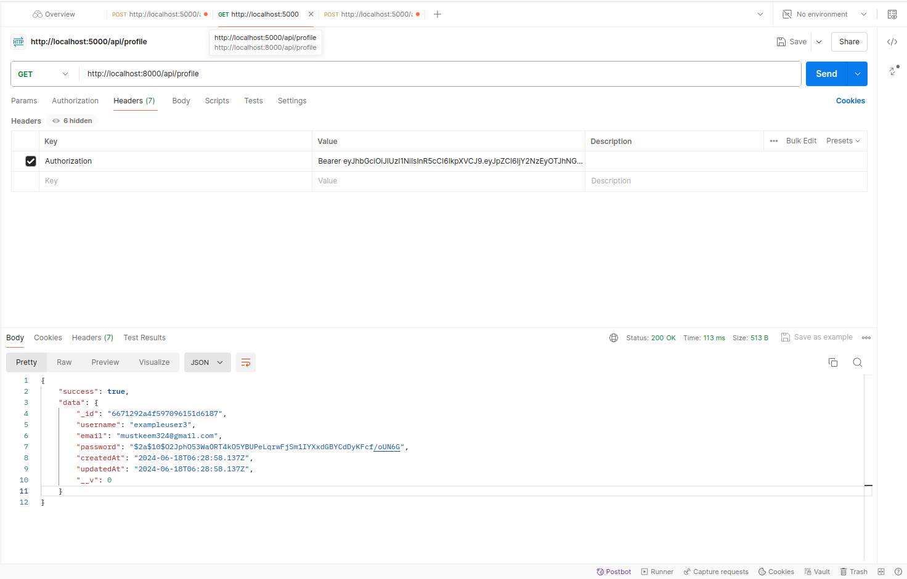

# User Authentication API

This project is a Node.js API for user authentication, including user registration, login, and profile management. It uses Express.js for the server, MongoDB for data storage, and NodeMailer for sending confirmation emails.

## Features

- User Signup
- User Login
- User Profile Retrieval
- Confirmation Email after Signup

## Technologies Used

- Node.js
- Express.js
- MongoDB with Mongoose
- JSON Web Token (JWT)
- Bcrypt.js for password hashing
- NodeMailer for sending emails
- dotenv for environment variables

## Getting Started

### Prerequisites

- Node.js installed on your machine
- MongoDB instance (local or cloud-based, e.g., MongoDB Atlas)

### Installation

1. Clone the repository:
    ```bash
    git clone https://github.com/yourusername/user-auth-api.git
    cd user-auth-api
    ```

2. Install the dependencies:
    ```bash
    npm install
    ```

3. Set up environment variables:
    Create a `.env` file in the root directory and add the following:
    ```plaintext
    PORT=8000
    MONGO_URI=your_mongo_db_connection_string
    JWT_SECRET=your_jwt_secret
    EMAIL=your_email
    EMAIL_PASSWORD=your_email_password
    CLIENT_URL=http://localhost:8000
    ```

### Running the Application

To start the server, run:
```bash
npm start
```

The server should be running on `http://localhost:8000`.

### API Endpoints

#### Signup

- **Endpoint**: `POST /api/signup`
- **Description**: Registers a new user.
- **Request Body**:
    ```json
    {
        "username": "exampleuser",
        "email": "user@example.com",
        "password": "password123"
    }
    ```
- **Response**:
    ```json
    {
        "success": true,
        "token": "jwt_token"
    }
    ```

#### Login

- **Endpoint**: `POST /api/login`
- **Description**: Logs in an existing user.
- **Request Body**:
    ```json
    {
        "email": "user@example.com",
        "password": "password123"
    }
    ```
- **Response**:
    ```json
    {
        "success": true,
        "token": "jwt_token"
    }
    ```

#### Profile

- **Endpoint**: `GET /api/profile`
- **Description**: Retrieves the user's profile information.
- **Headers**:
    ```json
    {
        "Authorization": "Bearer jwt_token"
    }
    ```
- **Response**:
    ```json
    {
    "success": true,
    "data": {
        "_id": "6671292a4f597096151d6187",
        "username": "exampleuser3",
        "email": "mustkeem324@gmail.com",
        "password": "$2a$10$O2JphO53WaORT4fffkO5YBUPeLqrwFjSm1IYXxdGBYCdDyKFcf/oUN6G",
        "createdAt": "2024-06-18T06:28:58.137Z",
        "updatedAt": "2024-06-18T06:28:58.137Z",
        "__v": 0
    }
   }
    ```

### Code Structure

- `src/`
  - `controllers/`
    - `authController.js`: Contains the logic for handling authentication-related requests.
  - `middleware/`
    - `auth.js`: Middleware for protecting routes.
  - `models/`
    - `User.js`: Mongoose model for the User schema.
  - `routes/`
    - `authRoutes.js`: Defines the routes for authentication endpoints.
  - `app.js`: Initializes the Express app and sets up middleware and routes.
  - `server.js`: Starts the server.

### Postman Demo Image
- **Signup**


- **Login**


- **Profile**


### Additional Notes

- **Password Hashing**: Passwords are hashed using bcrypt.js before storing in the database.
- **JWT**: JSON Web Tokens are used to authenticate users. Tokens are signed with a secret key and have a 1-day expiration time.
- **Email Confirmation**: After signing up, a confirmation email is sent to the user's email address with a link to confirm their account.

### License

This project is licensed under the MIT License. See the [LICENSE](LICENSE) file for details.

### Contact

For any questions or feedback, please contact [https://t.me/cheggnx](https://t.me/cheggnx).
